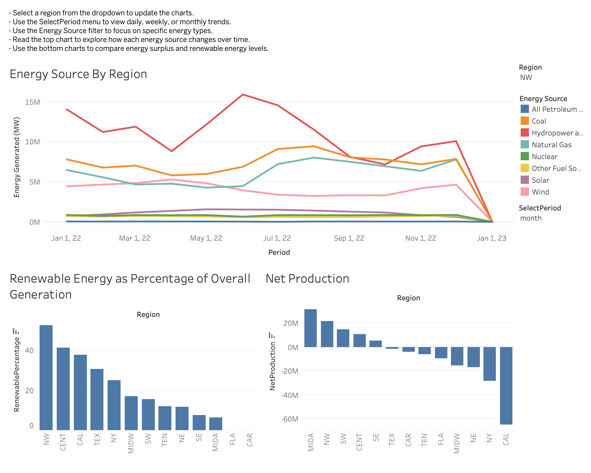
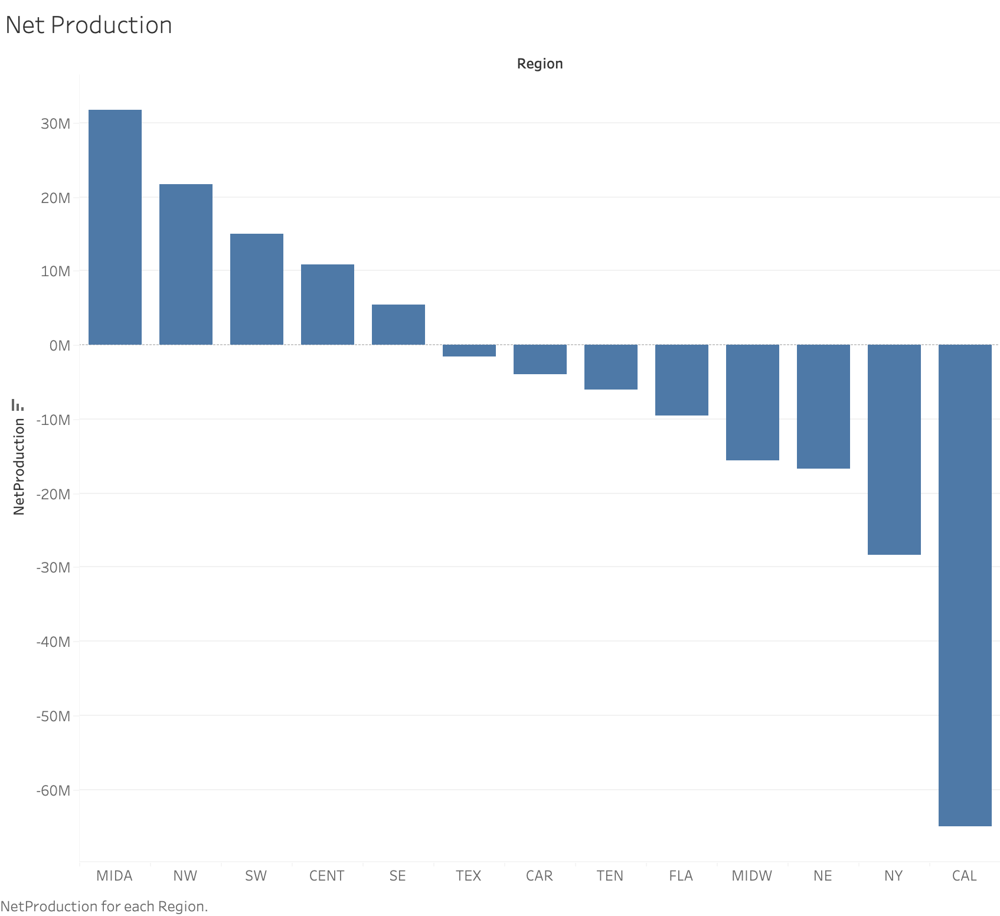
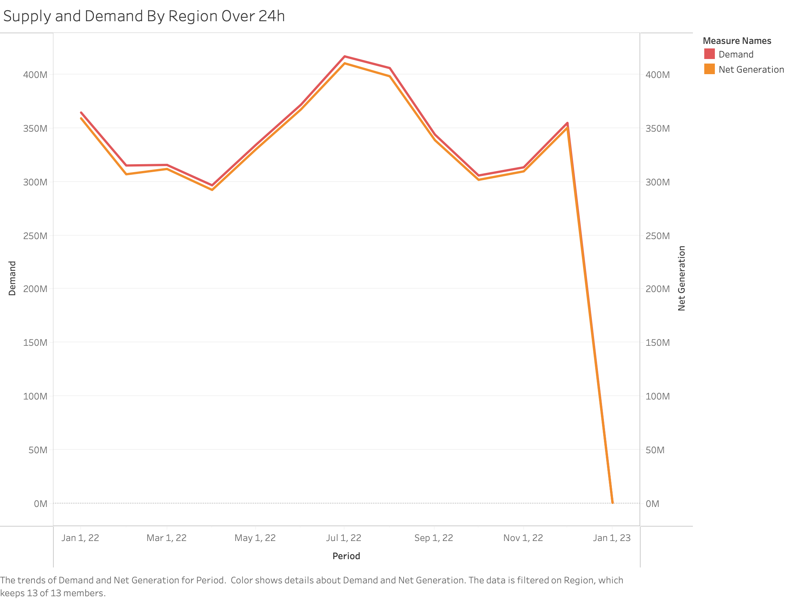
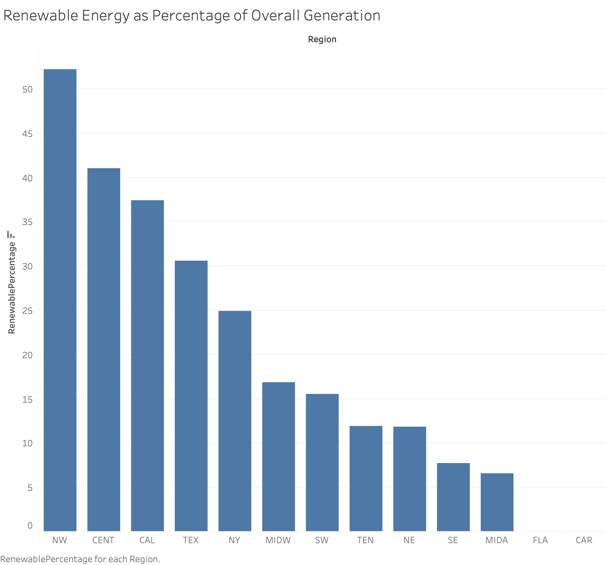
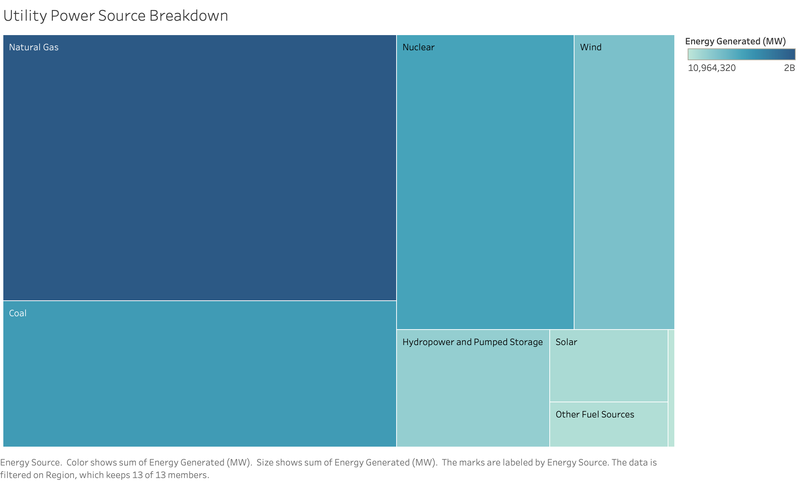
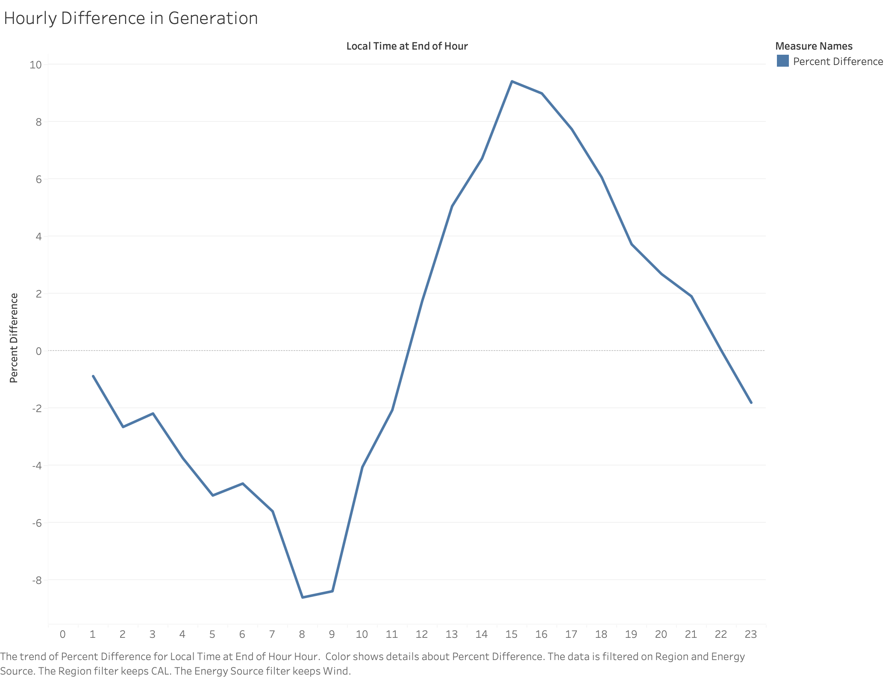
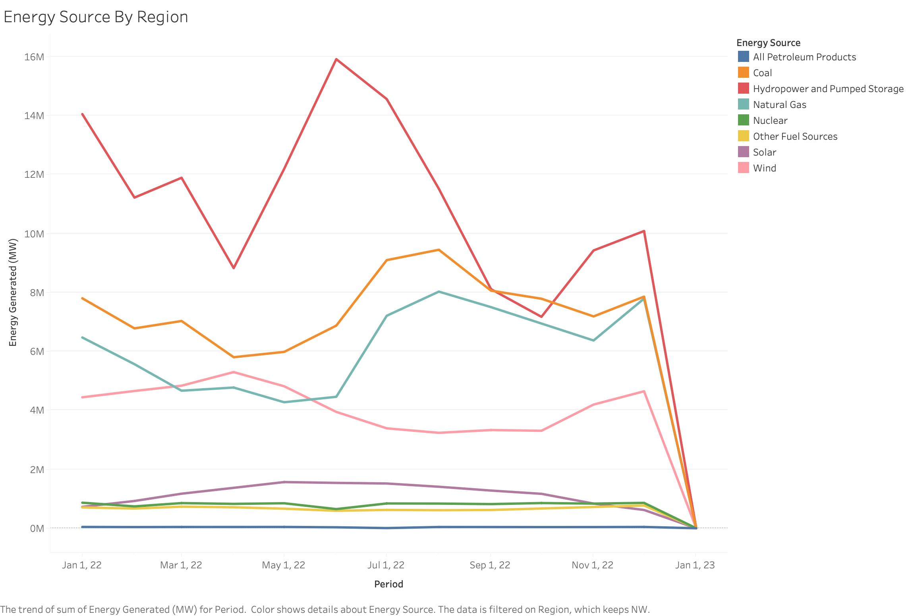
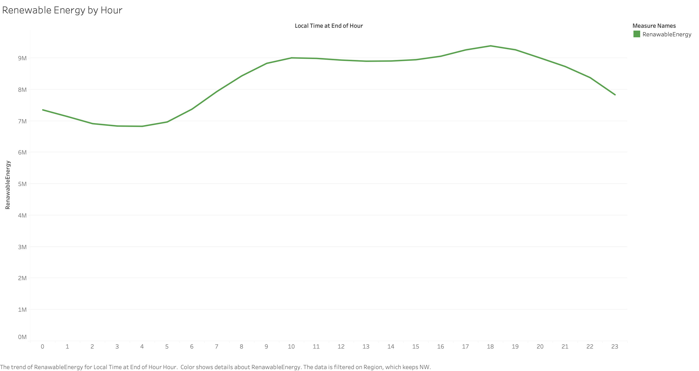

# Intel Data Center — Tableau Analysis

Tableau dashboards analyzing US regional energy data to help Intel's Sustainability Team identify the best location for a new data center, with a focus on energy surplus and renewable energy generation.

🔗 [View Interactive Dashboard on Tableau Public](https://public.tableau.com/views/IntelDataCenterAnalysis/Dashboard)

## Dashboard

## Overview

Intel is planning a new data center and needs to identify regions that produce a surplus of energy at competitive prices while relying on renewable sources. This analysis examines energy production, demand, and renewable energy generation across 12 US regions using 2022 data.

## Key Findings

**Net Production** — The regions with positive net production (generating more than they consume) are MIDA, NW, SW, CENT, and SE. The Mid-Atlantic (MIDA) region has the highest energy surplus, making it a reliable candidate for stable energy supply.

**Renewable Energy** — The top 3 regions by renewable energy percentage are NW (~52%), CENT (~41%), and CAL (~38%). The Northwest leads due to its strong hydropower infrastructure, while California benefits from significant solar investment and policy support. The Central region benefits from large wind energy capacity across the Great Plains.

**Best Regions for Both** — NW and CENT appear in both the net producer list and the top 5 for renewable energy generation. This makes them the strongest candidates — they offer both energy reliability and sustainability.

**Mid-Atlantic Energy Surplus** — In the MIDA region, the greatest energy surplus occurs in the spring months, when demand is lower but generation remains stable.

**California Wind Energy** — California generates the most wind energy between hours 12 and 22 (midday to late evening), with the largest increase around hour 15. Wind generation is lowest at night and early morning, driven by sea breeze patterns.

**Recommendation** — The Northwest (NW) region is the best location for Intel's next data center. It ranks 2nd in net energy surplus, leads all regions in renewable energy percentage, and maintains steady contributions from hydropower and wind throughout the year. States like Washington and Oregon offer stable energy supply, high renewable capacity, and a low carbon footprint — aligning with Intel's sustainability goals.

## Worksheets

### Net Production

Bar chart of net energy surplus/deficit by region (Net Generation − Demand), sorted descending. MIDA, NW, SW, CENT, and SE are the only net producers.

### Supply and Demand By Region

Dual axis line chart comparing Demand vs Net Generation over time. Uses a region dropdown filter and SelectPeriod parameter (day / week / month) to explore trends at different time levels.

### Renewable Energy

Bar chart of renewable energy (wind + solar + hydropower) as a percentage of overall generation by region, sorted descending. NW leads at ~52%.

### Utility Power Source Breakdown

Tree map showing the energy source composition by region and balancing authority. Natural gas and coal dominate nationally, while renewables vary significantly by region.

### Hourly Difference in Generation

Line chart of percent difference in wind energy generation by hour for California. Wind generation increases sharply from midday, peaking around hour 15, and turns negative after hour 22.

### Energy Source By Region

Line chart of all energy sources over time for the Northwest region. Hydropower dominates with steady generation, supported by consistent wind energy throughout the year.

### Renewable Energy by Hour

Line chart of renewable energy generation across 24 hours of the day. The Northwest maintains consistently high and stable renewable generation throughout the day, unlike California which peaks midday due to solar.

## Tableau Features Used

- **Calculated Fields** — NetProduction, RenewableEnergy, RenewablePercentage, Period
- **Parameters** — SelectPeriod (day / week / month)
- **Dual Axis** — Synchronized Demand and Net Generation on Supply and Demand chart
- **Tree Map** — Energy source breakdown by region
- **Filters** — Region dropdown, Energy Source dropdown
- **Dashboard** — Interactive layout with linked filters across charts

## Data

Two datasets from Intel's Sustainability Team covering US regional energy production in 2022:

- `energy_dataset` — hourly demand and net generation by region and energy source
- `energy_data_by_source` — energy generated by source type across regions and balancing authorities

**Regions:** MIDA · NW · SW · CENT · SE · TEX · CAR · TEN · FLA · MIDW · NE · NY · CAL
